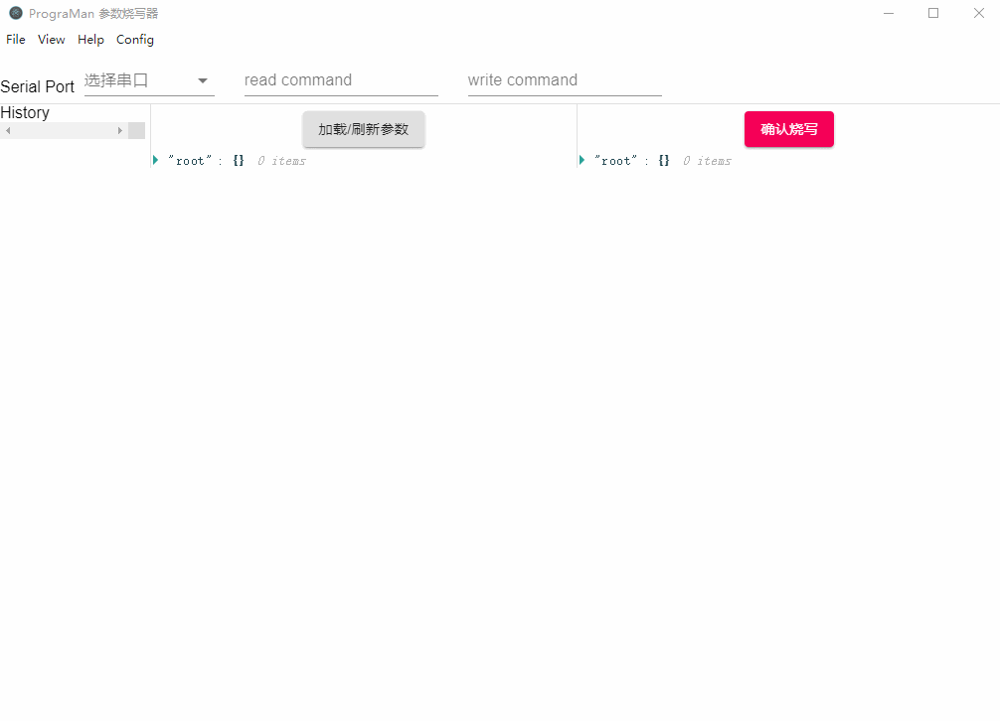
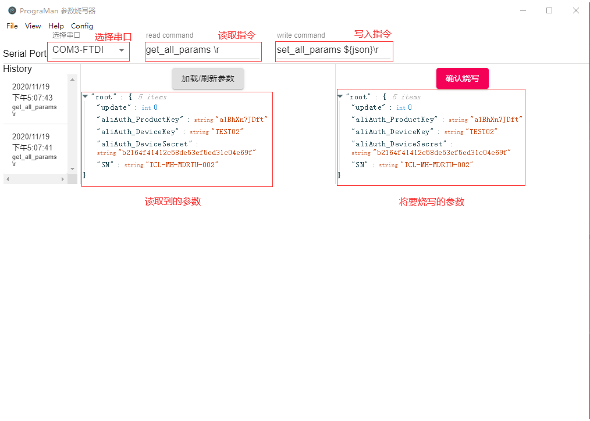

# 使用展示

<div style="text-align:center">
  
</div>


<br/>
<br/>
<br/>

# 简介

这是一个用于嵌入式设备的上位机，关于上位机更详细的介绍请见：https://blog.csdn.net/jiladahe1997/article/details/107650245。

本软件主要使用Electron编写。

主要用途：

 - 用于嵌入式设备的序列号、基本参数等出厂配置。

 <br/>
 <br/>
 <br/>

# 安装和使用方法：


## 安装

在网页右边Release处找到最新版本，下载安装即可（目前暂时只测试了windows版本）。


## 使用

1. 按照下面 **接口说明** 中的要求，对你的嵌入式设备进行软件编写

2. 通过串口线将你的设备和电脑连接上

3. 打开PrograMan，选择串口，输入 **接口说明** 中的读取指令和写入指令

4. 点击 `加载/刷新参数`，会将读取到的数据以可视化json的形式同时展示在读取区域和写入区域。你可以观察到，读取区域不可编辑，写入区域则可以进行编辑。

5. 在写入区域根据你的要求，对json进行编辑。

6. 点击 `确认烧写`，显示烧写成功则说明烧写成功；否则会显示烧写失败。

7. 可以再次点击 `加载/刷新参数`，确认烧写成功。

<br/>
<br/>

  

<br/>
<br/>
<br/>
<br/>

# 接口说明

本软件的实现原理很简单。本质类似于一个串口Shell，可以参考RT-thread的控制台：[FinSH 控制台](https://www.rt-thread.org/document/site/programming-manual/finsh/finsh/)。

其工作原理是：

 - 读取：PrograMan通过串口发送一个字符串`ReadCommand`,设备解析到这个特定的字符串后，读取位于EEPROM/FLASH/其他非易失性存储介质上的参数，并通过串口发送回PrograMan。

 - 烧写：同理。PrograMan发送一个字符串`WriteCommand`后面跟上特定的参数，例如 `WriteCommand {"id":1,"SN":"TEST_20201119_01"}`。设备同样对这个指令以及参数进行解析，并将参数写入参数区，并发送一个回复给PrograMan指示烧写成功与否。

<br/>

 ### 因此你需要做的事包括：

#### 裸机或者RTOS实时操作系统
 1. 指定一个 `ReadCommand` 和一个 `WriteCommand`
    注意 `WriteCommand` 中使用${json}作为目标json。例如`WriteCommand ${json}\r`会被替换成`WriteCommand {"SN":"TEST01"}\r`
 2. 编写 `ReadCommand` 和 `WriteCommand` 对应的处理函数。<br/>
 **ReadCommand必须返回json字符串**<br/>
 **WriteCommand的参数也必须是json字符串**<br/>
 因此我个人建议，直接以json字符串作为设备上保存参数的格式。

 3. 编写串口中断处理函数，使得串口收到 ReadCommand 或 WriteCommand 时，能够顺利的执行2中对应的函数。<br/> 一般而言，如果你使用Shell，那么这一步Shell已经帮你做了，例如RT-thread的控制台提供MSH_EXPORT宏定义； 如果你不使用Shell，则需要自己编写串口中断函数。

<br/>

 #### Linux或安卓系统

TODO


 <br/>
 <br/>

  <br/>
 <br/>

# 示例

## ReadCommand解析函数

```c
/* 参数区位于Flash上，位置0x08100000 */
#define PARAMS_FLASH_START_ADDRESS   0x08100000  
static uint8_t * param_flash_ptr = (uint8_t*)PARAMS_FLASH_START_ADDRESS;
uint8_t output_count = 0;

/* ReadCommand处理函数 */
static BaseType_t get_all_params(char *pcWriteBuffer, size_t xWriteBufferLen, const char *pcCommandString) {
    /* 直接使用cjson解析参数区，有危险！需要改进TODO */
    BaseType_t ret = pdTRUE;
    bool string_valid = false;
    cJSON * json = cJSON_Parse((const char*)param_flash_ptr);
    char * json_str = cJSON_PrintUnformatted(json);
    int len  = strlen(json_str);

    string_valid = *param_flash_ptr != 0xff;
    if(!string_valid) goto end;

    /* 将解析出的结果通过串口返回 
     * 这里使用的是FreeRTOS-CLI，将结果分段多次输出，以节省RAM
     * 所以看起来比较麻烦。效果等同于print(json_str);
     */
    /* if need output multiple times */
    if(len > (output_count+1) * FREERTOS_CLI_OUTPUT_MAX_BUFFER_SIZE) {
        strncpy(pcWriteBuffer, json_str + output_count * FREERTOS_CLI_OUTPUT_MAX_BUFFER_SIZE, 
                FREERTOS_CLI_OUTPUT_MAX_BUFFER_SIZE);
        output_count++;
        ret = pdTRUE;
        goto end;
    } else {
        strncpy(pcWriteBuffer, json_str + output_count * FREERTOS_CLI_OUTPUT_MAX_BUFFER_SIZE, 
                (output_count+1) * FREERTOS_CLI_OUTPUT_MAX_BUFFER_SIZE - len);
        output_count = 0;
        ret = pdFALSE;
        goto end;
    }

    /* 结束 */
end:
    cJSON_Delete(json);
    free(json_str);
    return ret;
}
```

## WriteCommand解析函数
```c
static BaseType_t set_param(char *pcWriteBuffer, size_t xWriteBufferLen, const char *pcCommandString) {
    const char * param = NULL;
    BaseType_t param_len = 0;

    /* 通过FreeRTOS-CLI提供的API获取参数 */
    param = FreeRTOS_CLIGetParameter(pcCommandString, 1, &param_len);
    if(param == NULL) {
        sprintf(pcWriteBuffer, "ERROR\r\nMust have 1 paramters!");
        return pdFALSE;
    }

    /* 校验JSON有效性 */
    cJSON * json = cJSON_Parse(param);
    if(json == NULL) {
        sprintf(pcWriteBuffer, "ERROR\r\nJson parse fail");
        return pdFALSE;
    }

    char * jsonstr = cJSON_Print(json);
    /* 直接调用底层函数，把字符串写入FLASH */
    utils_write_flash(jsonstr);

    /* 结束 */
    cJSON_Delete(json);
    free(jsonstr);
    sprintf(pcWriteBuffer, "OK\r\n");
    return pdFALSE;
}
```

## 串口中断处理函数

直接使用Shell自带的命令
S
```c
FREERTOS_SHELL_CMD_REGISTER("set_all_params","设置设备参数",set_param,1);
FREERTOS_SHELL_CMD_REGISTER("get_all_params","get_all_params",get_all_params,0);
```

  <br/>
 <br/>

# 联系方式
e-mail：972931182@qq.com

由于本人审美有限，界面可能不太好看，欢迎有兴趣的朋友帮忙设计界面。

有任何功能上的建议欢迎提issue。